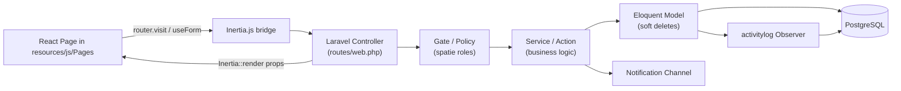

## TALAIS Laravel + Inertia + PostgreSQL Plan

### 1. Decisions locked in

- **Stack:** Laravel 11 (PHP 8.2+) + Inertia.js + React 18 (Vite) + PostgreSQL 16 + Tailwind + shadcn/ui.
- **Repo layout:** monorepo. Laravel root replaces the current Vite-only root; existing React code from [src/](src/) migrates into `resources/js/`. The current [package.json](package.json) becomes the Vite/Inertia frontend manifest (base44 deps removed).
- **DB:** PostgreSQL for now (capstone manuscript still says MySQL on paper; Laravel migrations are db-agnostic so we can switch later by changing `DB_CONNECTION`).
- **Schema:** all 29 tables from section 4 of the DOCX; **feature delivery order** follows the mini-project criteria mapping in section 5 (auth, RBAC, audit, dashboard, notifications, reporting, ...).
- **UI:** the existing visual design is **frozen**. The migration is a data-layer swap, not a redesign. See section 1a for the explicit no-touch list.

### 1a. UI preservation guarantee (non-negotiable)

The user's existing look-and-feel ships exactly as-is. The migration only swaps the data source (base44 SDK → Inertia props from Laravel). Concretely:

**Stays byte-identical (just relocated from `src/` → `resources/js/`):**

- All 49 shadcn/ui primitives in [src/components/ui/](src/components/ui/) — `button.jsx`, `card.jsx`, `dialog.jsx`, `sidebar.jsx`, `table.jsx`, `form.jsx`, etc. Not a single className changes.
- The app shell: [src/Layout.jsx](src/Layout.jsx) — sidebar nav structure, role-scoped `NAV_ADMIN`/`NAV_FACULTY`/`NAV_PARENT` arrays, dropdown menu, bell icon, branding.
- Shared components: [src/components/shared/StatCard.jsx](src/components/shared/StatCard.jsx), [src/components/shared/PageHeader.jsx](src/components/shared/PageHeader.jsx), [src/components/shared/EmptyState.jsx](src/components/shared/EmptyState.jsx).
- All page-level JSX in [src/pages/](src/pages/) — `Dashboard.jsx`, `Students.jsx`, `Enrollment.jsx`, `Grading.jsx`, `Attendance.jsx`, `ParentPortal.jsx`, etc. Markup, layout grids, Tailwind classes, lucide icons, Recharts components, color tokens — all preserved.
- Settings sub-components: `src/components/settings/AuditLog.jsx`, `SchoolYearConfig.jsx`, `BackupManagement.jsx`, `DocumentTemplates.jsx`.
- Enrollment wizard: [src/components/enrollment/StudentForm.jsx](src/components/enrollment/StudentForm.jsx) — every step, every field layout.
- [tailwind.config.js](tailwind.config.js), [postcss.config.js](postcss.config.js), [components.json](components.json) — kept verbatim so Tailwind tokens, theme colors, animations, and shadcn CLI config survive.
- Fonts, favicon, and any assets under `public/` (will move to Laravel's `public/`).

**Allowed to change inside page files (data plumbing only):**

- `import { base44 } from "@/api/base44Client"` → removed.
- `useQuery({ queryFn: () => base44.entities.X.list() })` → `usePage().props.x` (data already hydrated by the Laravel controller).
- `import { Link } from "react-router-dom"` → `import { Link } from "@inertiajs/react"` (same `<Link>` API surface where possible).
- `useNavigate()` → `router.visit()`.
- `useAuth()` from [src/lib/AuthContext.jsx](src/lib/AuthContext.jsx) → `usePage().props.auth.user`.
- Form submit handlers: `fetch`/`base44` calls → Inertia `useForm().post(...)`. The form's JSX, field components, validation messages UI — unchanged.

**Verification gate before each wave merges:** a side-by-side screenshot diff of every migrated page against the pre-migration build. Any pixel-level regression is a blocker, not an acceptable trade-off. If a Laravel/Inertia constraint forces a UI change, we stop and discuss before touching markup.

### 2. Repo restructure

Current root → Laravel root. Move/clean:

- Move `src/` → `resources/js/` (rename `src/pages/` → `resources/js/Pages/` to match Inertia conventions).
- Delete: [entities/](entities/) (base44 entity schemas, replaced by Laravel migrations + Eloquent models), `src/lib/app-params.js`, `src/lib/AuthContext.jsx`, `src/lib/NavigationTracker.jsx` (Inertia handles all of this).
- Delete deps from [package.json](package.json): `@base44/sdk`, `@base44/vite-plugin`. Add: `@inertiajs/react`, `laravel-vite-plugin`.
- Rewrite [vite.config.js](vite.config.js) to use `laravel-vite-plugin` + `@vitejs/plugin-react` (drop base44 plugin).
- Keep as-is: [tailwind.config.js](tailwind.config.js), [postcss.config.js](postcss.config.js), [components.json](components.json), all of `src/components/ui/*`, `src/lib/utils.js`, [eslint.config.js](eslint.config.js).

### 3. Laravel backend bootstrap

- `composer create-project laravel/laravel temp-laravel` then move generated files into root (or run `composer init` directly here) — produces `app/`, `bootstrap/`, `config/`, `database/`, `routes/`, `artisan`, etc.
- `composer require laravel/breeze --dev && php artisan breeze:install react` — installs Inertia + React + Ziggy scaffolding aligned to our existing React/Tailwind stack. Discard Breeze's default Tailwind/Vite configs (we keep ours); keep its auth controllers/middleware as the starting point.
- `composer require laravel/sanctum spatie/laravel-permission spatie/laravel-activitylog barryvdh/laravel-dompdf maatwebsite/excel pragmarx/google2fa-laravel`.
- `.env` for PostgreSQL:

```bash
DB_CONNECTION=pgsql
DB_HOST=127.0.0.1
DB_PORT=5432
DB_DATABASE=talais
DB_USERNAME=postgres
DB_PASSWORD=
```

### 4. PostgreSQL schema — translation rules from the DOCX

The DOCX schema is MySQL-flavored. Laravel migrations abstract most of it; specific PG mappings to apply consistently across all 29 tables:

- `BIGINT UNSIGNED PK` → `$table->id();` (PG `bigserial`, no UNSIGNED concept).
- `TINYINT(1)` flags → `$table->boolean(...)`.
- `ENUM` columns → `$table->enum('col', [...])`. Laravel emits a PG `CHECK` constraint, which preserves the spec semantics.
- `JSON` (e.g. `audit_logs.old_values/new_values`, `transfer_records.documents_received`) → `$table->jsonb(...)` (PG native, indexable; preferred over `json`).
- `CHAR(36)` UUID PK on `notifications` → `$table->uuid('id')->primary();` (PG has a native `uuid` type, much better than CHAR(36)).
- `VARCHAR(191)` (a MySQL utf8mb4 index-length workaround) → plain `string('email', 191)` — PG has no such limit, but we keep 191 for portability.
- `TIMESTAMP NULL` for `deleted_at` → `$table->softDeletes();` (Eloquent SoftDeletes trait).
- All FKs use `$table->foreignId(...)->constrained()->onDelete('restrict')` (or cascade for junction tables like `student_parents`, `grade_level_subjects`).
- For ENUMs we want to be tolerant of changes (e.g. `transfer_records.transfer_type` may grow), use `$table->string(...)` + a Postgres `CHECK` via `DB::statement` only when stability matters; otherwise `enum()` is fine.

### 5. Migrations & models — order matches FK dependencies

Group A (no FKs, build first):

- `users`, `school_years`, `grade_levels`, `subjects`.

Group B (depend on A):

- `parents`, `faculty`, `sections` (FK adviser→users), `grade_level_subjects`, `quarters`.

Group C (core academic linkage):

- `students`, `student_parents`, `enrollments`, `class_schedules`.

Group D (academic events, depend on `enrollments`):

- `assessment_components`, `student_grades`, `attendance_records`, `homeroom_guidance_assessments`, `sf3_book_records`.

Group E (annual / reporting):

- `student_health_records`, `student_violations`, `transfer_records`, `nat_results`, `key_performance_indicators`, `pir_report_snapshots`, `grade_review_assignments`.

Group F (system tables, mostly Laravel defaults):

- `notifications`, `audit_logs`, `password_reset_tokens` (Breeze provides), `backup_logs`.

Each gets a matching Eloquent model in `app/Models/` with relationships, casts (esp. `jsonb` → `array`, `enum` columns → custom Enum casts), and `SoftDeletes` where the DOCX shows a `deleted_at`.

### 6. RBAC — three roles, plus Grade Level Head flag

Use `spatie/laravel-permission`:

- Roles: `admin`, `faculty`, `parent` (no `student` — confirmed in section 2 of the DOCX).
- Boolean modifier: `users.is_grade_level_head` (also denormalized on `faculty.is_grade_level_head` per spec). A Laravel Gate `viewGradeLevelData` checks both `role=faculty` and the head flag scoped to the section's `grade_level_id`.
- Middleware on every route group: `auth`, `verified`, `role:admin|faculty|parent`. Parent routes additionally pass through a `parent.scope_to_current_year` middleware that strips out any `school_year_id` filter not equal to the active year, enforcing section 3.8's hard limit.

### 7. Frontend rewiring (keep UI, replace data layer)

Per section 1a, **JSX markup, classNames, and component composition are off-limits**. For each existing page in [src/pages/](src/pages/), the changes are surgical:

- Move file to `resources/js/Pages/` (rename only — no content rewrite).
- Strip every `import { base44 } from '@/api/base44Client'` and every `@base44/sdk` import.
- Replace `useQuery(... base44.entities.X.list())` with **Inertia props**: the Laravel controller's `Inertia::render('Students/Index', ['students' => ...])` passes data, and the page reads it via `usePage().props.students`. The destructuring shape mimics what the page already expects so downstream JSX is untouched. We'll keep `@tanstack/react-query` only for genuinely-async client-side things (search-as-you-type, optimistic updates).
- Replace `react-router-dom` (`Link`, `useNavigate`) with `@inertiajs/react` (`<Link href>`, `router.visit`) — same `<Link>` props/children, so visible nav rendering is identical.
- Replace [src/lib/AuthContext.jsx](src/lib/AuthContext.jsx) with `usePage().props.auth.user` from Inertia's shared props (`HandleInertiaRequests` middleware in `app/Http/Middleware/`). The `useAuth()` consumer pattern can be kept by reimplementing `useAuth` as a thin wrapper over `usePage()` so existing call sites don't change.
- Forms: replace `react-hook-form` posts with Inertia's `useForm()` for server-validated submits; **the form's rendered fields, labels, error message components, and Tailwind classes stay the same** — only the submit handler's mechanism changes. Keep `react-hook-form` + `zod` for purely client-side wizards (e.g. enrollment multi-step) so the wizard UX is preserved exactly.
- `createPageUrl()` from [src/utils/index.ts](src/utils/index.ts) is kept (or re-pointed at Ziggy's `route()`) so existing `<Link to={createPageUrl("Students")}>` calls keep working without edits to the call sites.

### 8. Feature delivery — mini-project criteria first, full capstone overall

Wave-by-wave, each wave is shippable and demonstrable. References to mini-project criteria points are from section 5 of the DOCX.

- **Wave 1 — Foundation** (criteria: User Roles 15pts, Auth 15pts, Audit 10pts, Site Settings 10pts, Security 15pts):
  - Breeze auth → bcrypt/Argon2, password policy, lockout (`failed_login_count`, `locked_until` on `users`), Sanctum session, CSRF.
  - 2FA via email OTP using `pragmarx/google2fa-laravel` (email channel, not TOTP — matches spec).
  - `spatie/laravel-activitylog` wired into Eloquent observers → fills `audit_logs` per spec (with `old_values`/`new_values` jsonb).
  - Pages migrated: [src/pages/UserManagement.jsx](src/pages/UserManagement.jsx), [src/pages/AdminSettings.jsx](src/pages/AdminSettings.jsx), `src/components/settings/AuditLog.jsx`, `src/components/settings/SchoolYearConfig.jsx`.

- **Wave 2 — Core records** (Advanced User Mgmt 10pts, Advanced Data Controls 10pts):
  - `students`, `parents`, `student_parents`, `enrollments`, `sections`, `school_years`, `grade_levels`, `subjects`, `grade_level_subjects`.
  - Pages: [src/pages/Students.jsx](src/pages/Students.jsx), [src/pages/Sections.jsx](src/pages/Sections.jsx), [src/pages/Subjects.jsx](src/pages/Subjects.jsx), [src/pages/SchoolYears.jsx](src/pages/SchoolYears.jsx), [src/pages/Enrollment.jsx](src/pages/Enrollment.jsx), [src/components/enrollment/StudentForm.jsx](src/components/enrollment/StudentForm.jsx), [src/pages/StudentProfile.jsx](src/pages/StudentProfile.jsx).
  - Bulk Excel import via `maatwebsite/excel` (Import & Export 10pts).

- **Wave 3 — Academic engine** (CRUD 10pts, Form Validation 10pts):
  - Grading: `assessment_components` → computed `student_grades` via a `ComputeQuarterlyGrade` action (WW/PT/QA weights from `grade_level_subjects`).
  - Attendance: `attendance_records` with AM/PM ENUM, absence threshold notifier (Adviser comment, 20% rule).
  - Pages: [src/pages/Grading.jsx](src/pages/Grading.jsx), [src/pages/Attendance.jsx](src/pages/Attendance.jsx).

- **Wave 4 — Dashboards & notifications** (Dashboard 15pts, Notifications 10pts, Warnings 5pts):
  - [src/pages/Dashboard.jsx](src/pages/Dashboard.jsx) + [src/pages/Analytics.jsx](src/pages/Analytics.jsx) wired to controller queries (Recharts already installed).
  - Laravel Notifications + Gmail SMTP, fills `notifications` table; Inertia shared `unread_count` prop for the bell.
  - Absence-threshold queued job pushes alert to the class adviser.

- **Wave 5 — Reports & PDFs** (Reporting 10pts, PDF 5pts):
  - [src/pages/Form137.jsx](src/pages/Form137.jsx) + new SF1/SF2/SF4/SF5/Form138/PIR generators using `barryvdh/laravel-dompdf`. Templates in `resources/views/forms/`.
  - Excel exports via `maatwebsite/excel`.
  - [src/pages/ParentPortal.jsx](src/pages/ParentPortal.jsx) (current-year-only scope enforced by middleware).

- **Wave 6 — Specialized modules** (rest of capstone scope):
  - Health/BMI ([src/pages/HealthRecords.jsx](src/pages/HealthRecords.jsx)), violations ([src/pages/Violations.jsx](src/pages/Violations.jsx)), scheduling ([src/pages/Scheduling.jsx](src/pages/Scheduling.jsx)), NAT, KPI, transfer logs.
  - Backup system → `backup_logs` (Backup 10pts) via `spatie/laravel-backup`, scheduled in `app/Console/Kernel.php` (PG dump uses `pg_dump`).
  - SMS (Semaphore) for parent push notifications.

### 9. Data flow at a glance



### 10. What I will NOT touch yet

- DepEd LIS LRN-generation API (spec calls for it, but it's an external integration deferred to a later wave).
- SMS gateway selection beyond Semaphore stub.
- Production deployment (XAMPP local stays as the dev env per capstone Chapter III).
- The mini-project criteria's *Test Accounts* deliverable — I'll seed them in Wave 1 but fixture data for Grade 6 GEMINI / Kinder WHALE PM sample sections waits until Wave 2.

### 11. UI preservation contract — operational guardrails

Section 1a defines *what* stays the same. This section defines *how* I will execute the migration so the freeze is actually enforced — not just promised.

1. **One-page-at-a-time migration with visual parity gate.**
   - I migrate a single page per commit (`Dashboard.jsx` → `resources/js/Pages/Dashboard.jsx`, etc.).
   - Before merging that commit, run the pre-migration build (current Vite-only app) and the post-migration build (Laravel + Inertia) side-by-side at `1280×800` and `375×812` viewports. Capture both. Any visible diff in spacing, color, font weight, icon size, or component composition is a blocker — I revert and re-do the data plumbing without touching markup.
   - Order follows the wave order in section 8 so visual regressions are caught early on the highest-traffic screens (Dashboard, Layout shell, Login).

2. **No Breeze default styling leaks into the app.**
   - Immediately after `php artisan breeze:install react`, I delete: Breeze's `resources/css/app.css`, Breeze's `tailwind.config.js`, Breeze's `resources/js/Layouts/AuthenticatedLayout.jsx`, Breeze's `resources/js/Layouts/GuestLayout.jsx`, and Breeze's `resources/js/Components/*` (input, label, primary-button, etc.).
   - Restore our [tailwind.config.js](tailwind.config.js), [postcss.config.js](postcss.config.js), [components.json](components.json), and `src/index.css` (moved to `resources/css/app.css`) as the source of truth.
   - Re-point Breeze's auth pages (`Login.jsx`, `Register.jsx`, `ForgotPassword.jsx`, `ResetPassword.jsx`, `ConfirmPassword.jsx`, `VerifyEmail.jsx`) to render inside our `AppLayout` (or a thin `GuestLayout` that mirrors the TALAIS branding — navy `#1e3a5f` background, amber-400 logo tile, `GraduationCap` fallback) using shadcn `Input`, `Button`, `Label`, `Card` from our existing `components/ui/`. The login screen must visually match the rest of TALAIS, not the default Breeze look.
   - Keep only Breeze's *controllers, requests, and middleware* (`AuthenticatedSessionController`, `RegisteredUserController`, `EmailVerificationPromptController`, etc.) — those have no UI.

3. **Icon and typography parity is non-negotiable.**
   - `lucide-react` stays as the only icon set. Same imports (`LayoutDashboard`, `UserPlus`, `Users`, `ClipboardCheck`, `BookOpen`, `FileText`, `HeartPulse`, `Calendar`, `Menu`, `Bell`, `LogOut`, `GraduationCap`, `ChevronDown`, `ChevronRight`, `BarChart3`, `AlertTriangle`, `Settings`, `Shield`, `Clock`, `User`), same exact sizing classes (`w-[18px] h-[18px]` for nav, `w-3.5 h-3.5` for chevrons, `w-5 h-5` for menu/topbar, `w-4 h-4` for buttons, `w-2 h-2` for status dots).
   - No swaps to Heroicons, Tabler, Phosphor, or Font Awesome. No size or stroke-width tweaks.
   - Font stack stays as whatever `tailwind.config.js` + `index.css` already define; I won't add a new `@font-face` or pull a different webfont.

4. **No new component libraries — extend with existing shadcn primitives only.**
   - New UI surfaces required by Laravel features (2FA OTP entry, audit log viewer, backup status panel, PDF preview modal, notification bell dropdown, Excel import dropzone) are built **only** from primitives already present in `src/components/ui/`: `Card`, `Dialog`, `Sheet`, `Table`, `Input`, `InputOTP` (already in shadcn), `Button`, `Badge`, `DropdownMenu`, `Tabs`, `Alert`, `Toast`, `Skeleton`, `Form`, etc.
   - No new dependencies like Material UI, Mantine, Chakra, Ant Design, or Headless UI's standalone packages. If a primitive is missing, I add it via `npx shadcn-ui@latest add <component>` so it lands styled with our existing theme tokens — never via a foreign UI kit.
   - Charts stay on `recharts` (already installed); same `<ResponsiveContainer>`, same color palette already used in [src/pages/Analytics.jsx](src/pages/Analytics.jsx) and [src/pages/Dashboard.jsx](src/pages/Dashboard.jsx).
   - Toast/notification system stays on whatever `src/components/ui/sonner.jsx` (or `toast.jsx`) currently provides — I won't bolt on `react-hot-toast` or `notistack`.

5. **CI/lint guards to catch regressions automatically.**
   - Add an ESLint rule disallowing imports from `react-router-dom` (catches accidental reverts) and from any non-`@/components/ui/*` icon or component package.
   - Add a `package.json` script `lint:ui-freeze` that greps `resources/js/Pages/**` for forbidden patterns: `from "react-router-dom"`, `from "@base44/sdk"`, `from "@mui/`, `from "@mantine/`, `from "antd"`, `from "@chakra-ui/`. CI fails on a hit.
   - Pre-commit hook (Husky + lint-staged, already in the React stack) runs the above on staged files only.

If any of these guardrails would block a Laravel/Inertia feature, I stop and surface the trade-off in writing — I don't silently relax the UI freeze.
